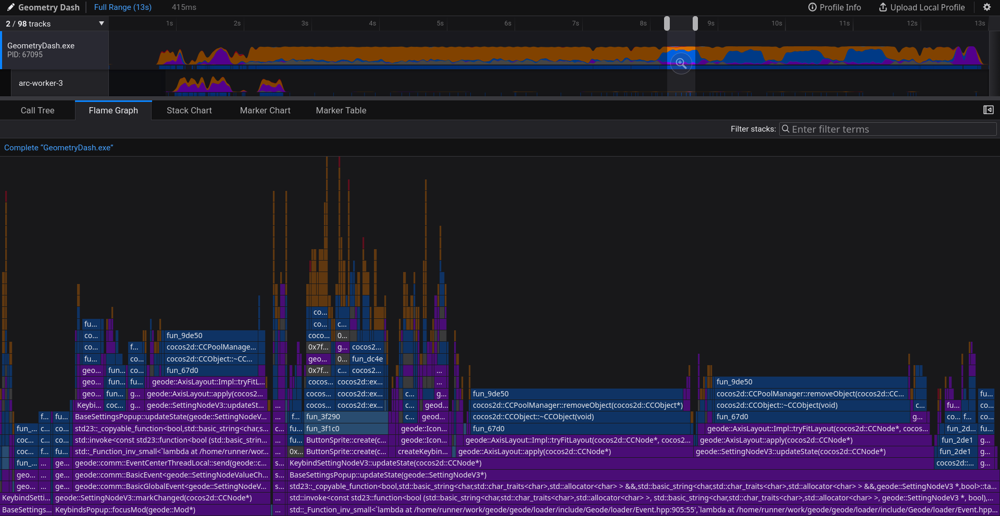

# GD Linux profiler

This repository contains helper scripts & programs to profile Geometry Dash running in Proton/Wine with Linux `perf`, producing Firefox fxprof profiler files that can be viewed in the Firefox profiler UI.



> [!NOTE]
> The profiler requires the LBR feature to be present in your CPU, available since Intel Haswell (4th gen or newer) or AMD Zen 4 (or newer) CPU with Linux 6.1+.

## Setup

Install dependencies:
```sh
pip install -r requirements.txt
```
(or whatever other way you prefer)

Build the converter:
```sh
cd converter
cargo build --release
```

`fxprof-converter` must be available in PATH to get fxprof `profile.json` files. The Python script doesn't have to be, but symlinking makes it easier to launch:
```sh
ln -s $(pwd)/converter/target/release/fxprof-converter ~/.local/bin/fxprof-converter
ln -s $(pwd)/gd-profile.py ~/.local/bin/gd-profile
```

## Running

Run in GD folder:
```sh
gd-profile
```

Customize frequency (default 1000) or wine path (default `$(which wine)`):
```sh
gd-profile -F 2000 --wine-path /usr/bin/wine
```

Customize executable & arguments:
```sh
gd-profile MyGeometryGDPS.exe --geode:safe-mode
```

If everything goes well, you'll see the following logs:
```
[profiler] perf is now capturing samples
[profiler] waiting for the game to finish launching..
...
[profiler] nothing has been loaded in the last 3 seconds, assuming the game finished launching
[profiler] total modules loaded: 247
[profiler] writing metadata to /tmp/perf-<pid>.meta.txt
[profiler] nothing else to do, waiting for the game to exit...
```

`perf` starts capturing right away as soon as the game is launched, but the script waits a few extra seconds to let all the mods and DLLs load fully and then dump all modules. If you close the game too quickly, results are undefined.

After you close the game, the script will start processing the perf data and convert it into a Firefox profiler format that you can view at https://profiler.firefox.com

# TODO

* memory, thread events
