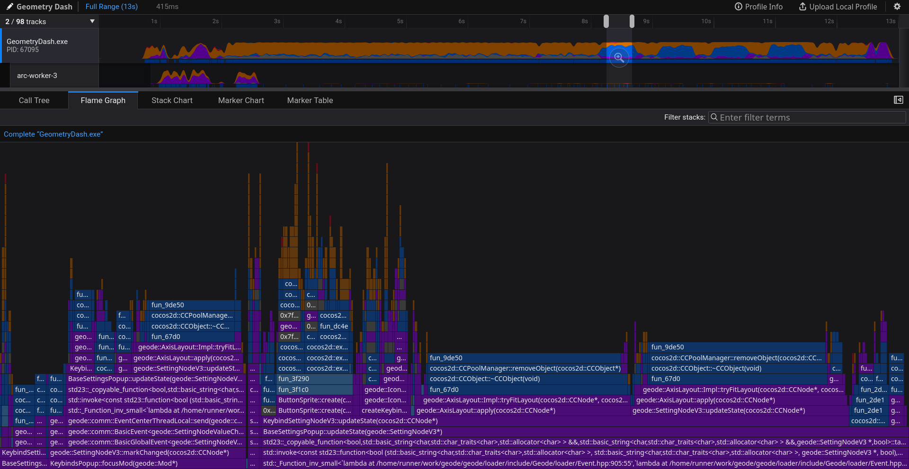

# GD Linux profiler

This repository contains helper scripts & programs to profile Geometry Dash running in Proton/Wine with Linux `perf`, producing Firefox fxprof profiler files that can be viewed in the Firefox profiler UI.



> [!NOTE]
> The profiler requires the LBR feature to be present in your CPU, available since Intel Haswell (4th gen or newer) or AMD Zen 4 (or newer) CPU with Linux 6.1+.

## Setup

Install dependencies:
```sh
pip install -r requirements.txt
```
(or whatever other way you prefer)

Build the converter:
```sh
cd converter
cargo build --release
```

`fxprof-converter` must be available in PATH to get fxprof `profile.json` files. The Python script doesn't have to be, but symlinking makes it easier to launch:
```sh
ln -s $(pwd)/converter/target/release/fxprof-converter ~/.local/bin/fxprof-converter
ln -s $(pwd)/gd-profile.py ~/.local/bin/gd-profile
```

## Running

Run in GD folder:
```sh
gd-profile
```

Customize frequency (default 1000 Hz) or wine path (default `$(which wine)`):
```sh
gd-profile -F 2000 --wine-path /usr/bin/wine
```

Customize executable & arguments:
```sh
gd-profile MyGeometryGDPS.exe --geode:safe-mode
```

If everything goes well, you'll see logs similar to this during profiling:
```
[profiler] listening on port 57683 for incoming mod connections
[profiler] Running GeometryDash.exe with Wine /usr/bin/wine (version wine-11.13), extra args: []
[profiler] GD is running, pid: 73234
[profiler] perf args: ['perf', 'record', '-g', '-F', '1000', '-p', '73234', '--call-graph', 'lbr']
[profiler] perf is now capturing samples
[profiler] nothing else to do, waiting for the game to exit...
...
[profiler] game exit detected, stopping perf
...
[profiler] fxprof profile now available at /home/dankpc/gd/instances/2.2081/profile.json and can be loaded at https://profiler.firefox.com/
```

As soon as the game is launched, multiple things are monitored: `perf` captures CPU samples, the helper mod (if installed) captures created `CCObject`s, and the script captures memory information as well as data about loaded binaries.

After you close the game, the script will start processing the perf data and convert it into a Firefox profiler format that you can view at https://profiler.firefox.com

Note that the data is not perfect, many stacks may stop after 10-15 functions even if they should go deeper, unfortunately as of now I could not figure out a fix to this, but the profiler is more than usable despite that.

## Helper mod

In the [`profiler-mod`](./profiler-mod/) subfolder, you will find the helper profiler mod. This mod hooks some parts of the game and provides various data for additional graphs. When not actively profiling, the mod is deactivated and does not do anything, avoiding any negative performance impact. However, it is designed to be extremely lightweight, so it's recommended to have it even when profiling, you are unlikely to see a performance issue.

# TODO

* gd.exe symbols using bindings
* thread events to display accurate thread ends?
* figure out how to fix the stacks, `--stitch-lbr` or `--call-graph dwarf` do not work
